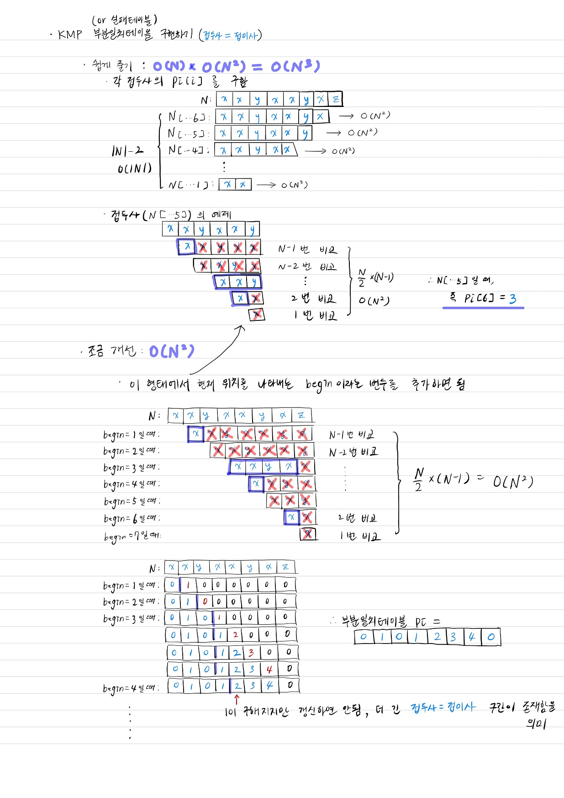
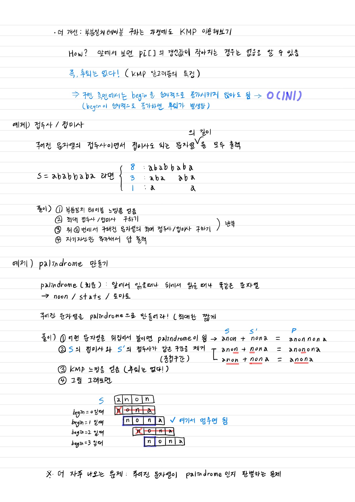
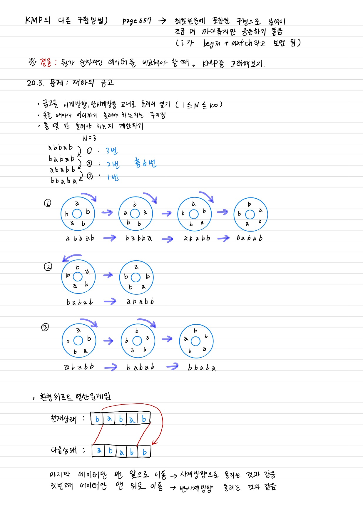
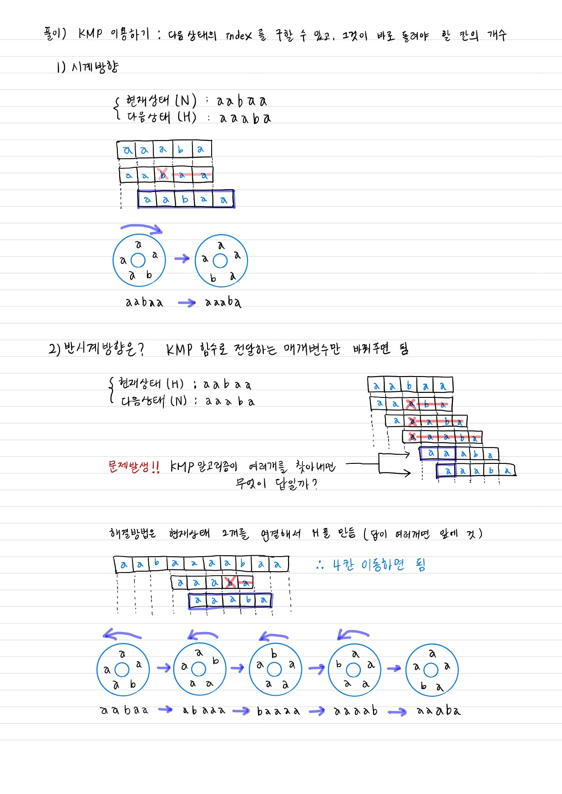
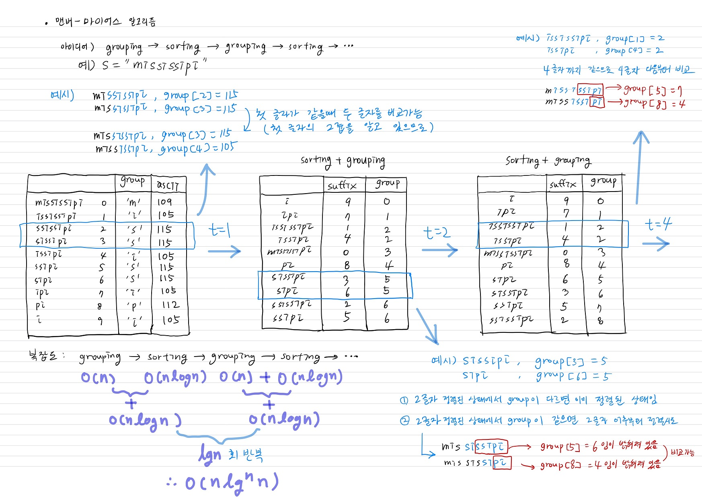
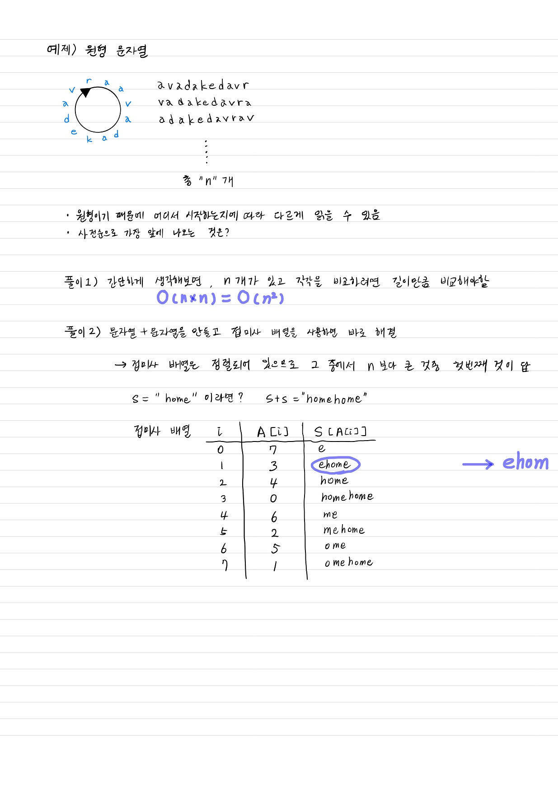
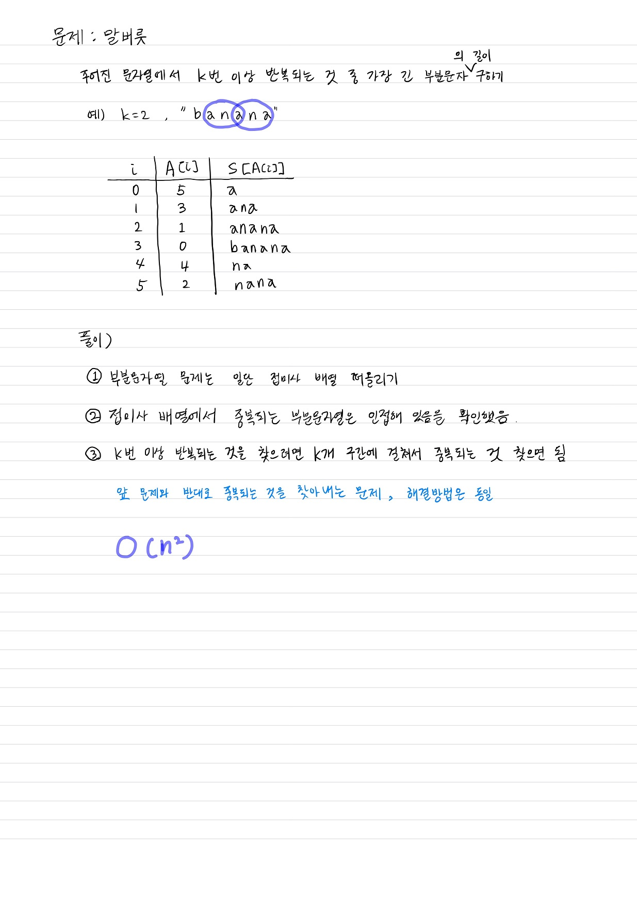

### 문자열 검색 : 단순한 알고리즘

코드 20.1 (페이지 645)

```c++
vector<int> naiveSearch(const string& H, const string& N)
{
    vector<int> ret;
    for(int begin = 0; begin + N.size() <= H.size(); ++begin)
    {
        bool matched = true;
        for(int i = 0; i < N.size(); ++i)
        {
            if(H[begin + i] != N[i])
            {
                matched = false;
                break;
            }
        }
        if(matched)
            ret.push_back(begin);
    }
    return ret;
}


int main()
{
    vector<int> positions = naiveSearch("avadakedavra", "da");

    for(auto&& pos : positions)
    {
        cout << pos << endl;
    }
}
```

### 문자열 검색 : KMP 알고리즘

코드 20.2 (페이지 649)

```c++
vector<int> kmpSearch(const string& H, const string& N)
{
    vector<int> ret;
    vector<int> pi = getPartialMatch(N);  // getPartialMatchNaive(N);

    int begin = 0, matched = 0;

    while(begin <= H.size() - N.size())
    {
        if(matched < N.size() && H[begin + matched] == N[matched])
        {
            ++matched;

            if(matched == N.size())
                ret.push_back(begin);
        }
        else
        {
            if(matched == 0)
            {
                ++begin;
            }
            else
            {
                begin += matched - pi[matched - 1];
                matched = pi[matched - 1];
            }
        }
    }
    return ret;
}

int main() {
    vector<int> positions = kmpSearch("avadakedavra", "da");

    for(auto&& pos : positions) {
        cout << pos << endl;
    }
}
```

### 부분 일치 테이블 계산하기 : 단순한 알고리즘

코드 20.3 (페이지 652)

```c++
vector<int> getPartialMatchNaive(const string& N)
{
    vector<int> pi(N.size(), 0);

    for(int begin = 1; begin < N.size(); ++begin)
    {
        for(int i = 0; i + begin < N.size(); ++i)
        {
            if(N[begin + i] != N[i])
                break;

            pi[begin + i] = max(pi[begin + i], i + 1);
        }
    }
    return pi;
}
```

### 부분 일치 테이블 계산하기 : KMP 알고리즘 이용하기

코드 20.4 (페이지 653)

```c++
vector<int> getPartialMatch(const string& N)
{
    vector<int> pi(N.size(), 0);

    int begin = 1, matched = 0;

    while(begin + matched < N.size())
    {
        if(N[begin + matched] == N[matched])
        {
            ++matched;
            pi[begin + matched - 1] = matched;
        }
        else
        {
            if(matched == 0)
            {
                ++begin;
            }
            else
            {
                begin += matched - pi[matched - 1];
                matched = pi[matched - 1];
            }
        }
    }
    return pi;
}
```

### 예제 : 접두사/접미사 문제

코드 20.5 (페이지 654)

```c++
vector<int> getPrefixSuffix(const string& s)
{
    vector<int> ret;
    vector<int> pi = getPartialMatch(s);

    int k = s.size();

    while(k > 0)
    {
        ret.push_back(k);

        k = pi[k-1];
    }
    return ret;
}


int main() {
    vector<int> lengths = getPrefixSuffix("ababbaba");

    for(auto&& len : lengths) {
        cout << len << endl;
    }
}
```

### 예제 : 팰린드롬 만들기

코드 20.6 (페이지 656)

```c++
int maxOverlap(const string& a, const string& b)
{
    vector<int> pi = getPartialMatch(b);

    int begin = 0, matched = 0;

    while(begin < a.size())
    {
        if(matched < b.size() && a[begin + matched] == b[matched])
        {
            ++matched;

            if(begin + matched == a.size())
                return matched;
        }
        else
        {
            if(matched == 0)
                ++begin;
            else
            {
                begin += matched - pi[matched - 1];
                matched = pi[matched - 1];
            }
        }
    }
    return 0;
}

int main()
{
    string a = "anon";
    string b = "anon";

    reverse(b.begin(), b.end());

    cout << a + b.substr(maxOverlap(a, b))  << endl;
}
```

### KMP 알고리즘의 다른 구현

코드 20.7 (페이지 657)

```c++
vector<int> kmpSearch2(const string& H, const string& N)
{
    vector<int> ret;
    vector<int> pi = getPartialMatch(N);

    int matched = 0;

    for(int i = 0; i < H.size(); ++i)
    {
        while(matched > 0 && H[i] != N[matched])
            matched = pi[matched - 1];

        if(H[i] == N[matched])
        {
            ++matched;

            if(matched == N.size())
            {
                ret.push_back(i - N.size() + 1);
                matched = pi[matched - 1];
            }
        }
    }
    return ret;
}
```

### 재하의 금고


(페이지 661)

```c++
int shifts(const string& original, const string& target)
{
	return kmpSearch(original + original, target)[0];
}
```

### 접미사 배열 알고리즘 : 단순한 버전


코드 20.8 (페이지 663)

```c++
class SuffixComparator {
public:
    const string& s;

    SuffixComparator(const string& s) : s(s)
    {
    }

    bool operator() (int i, int j)
    {
        return strcmp(s.c_str() + i, s.c_str() + j) < 0;
    }
};

vector<int> getSuffixArrayNaive(const string& s)
{
    vector<int> perm;

    for(int i = 0; i < s.size(); ++i)
        perm.push_back(i);

    sort(perm.begin(), perm.end(), SuffixComparator(s));

    return perm;
}

int main()
{
    vector<int> suffices = getSuffixArrayNaive("alohomora");

    for(auto&& suffix : suffices) {
        cout << suffix << endl;
    }
}
```

### 접미사 배열 알고리즘 : 멘버-마이어스 알고리즘

코드 20.9 + 20.10 (페이지 666)

```c++
class Comparator {
public:
    const vector<int>& group;
    int t;

    Comparator(const vector<int>& _group, int _t) : group(_group), t(_t)
    {
    }

    bool operator() (int a, int b)
    {
        if(group[a] != group[b])
            return group[a] < group[b];

        return group[a + t] < group[b + t];
    }
};

vector<int> getSuffixArray(const string& s)
{
    int t = 1;
    vector<int> group(s.size() + 1);

    for(int i = 0; i < s.size(); ++i)
        group[i] = s[i];

    group[s.size()] = -1;
    vector<int> perm(s.size());

    for(int i = 0; i < s.size(); ++i)
        perm[i] = i;

    while(t < s.size())
    {
        Comparator compareUsing2T(group, t);
        sort(perm.begin(), perm.end(), compareUsing2T);

        t *= 2;

        if(t >= s.size())
            break;

        vector<int> newGroup(s.size() + 1);
        newGroup[s.size()] = -1;
        newGroup[perm[0]] = 0;

        for(int i = 0; i < s.size(); ++i)
        {
            if(compareUsing2T(perm[i - 1], perm[i]))
                newGroup[perm[i]] = newGroup[perm[i - 1]] + 1;
            else
                newGroup[perm[i]] = newGroup[perm[i - 1]];
        }
        group = newGroup;
    }
    return perm;
}

int main()
{
    vector<int> suffices = getSuffixArray("alohomora");

    for(auto&& suffix : suffices) {
        cout << suffix << endl;
    }
}
```

### 예제 : 원형 문자열

코드 20.11  (페이지 663)

```c++
string minShift(const string& s)
{
    string s2 = s + s;
    vector<int> a = getSuffixArray(s2);

    for(int i = 0; i < a.size(); ++i)
    {
        if(a[i] <= s.size())
        {
            return s2.substr(a[i], s.size());
        }
    }
    return "fail";
}

int main()
{
    cout << minShift("avadakedavra") << endl;
}
```

### 예제 : 서로 다른 부분 문자열의 수

코드 20.12 (페이지 669)

```c++
int commonPrefix(const string& s, int i, int j)
{
    int k = 0;

    while(i < s.size() && j < s.size() && s[i] == s[j])
    {
        ++i; ++j; ++k;
    }
    return k;
}

int countSubstrings(const string& s)
{
    vector<int> a = getSuffixArray(s);
    int ret = 0;

    for(int i = 0; i < a.size(); ++i)
    {
        int cp = 0;

        if(i > 0)
            cp = commonPrefix(s, a[i - 1], a[i]);

        ret += s.size() - a[i] - cp;
    }
    return ret;
}

int main()
{
    cout << countSubstrings("banana") << endl;
}
```

### 문제 : 말버릇

코드 20.13 (페이지 674)

```c++
int longestFrequent(int k, const string& s)
{
    vector<int> a = getSuffixArray(s);
    int ret = 0;

    for(int i = 0; i + k <= s.size(); ++i)
    {
        ret = max(ret, commonPrefix(s, a[i], a[i + k - 1]));
    }

    return ret;
}

int main()
{
    cout << longestFrequent(2, "uhmhellouhmmynameislibe") << endl;
}
```
