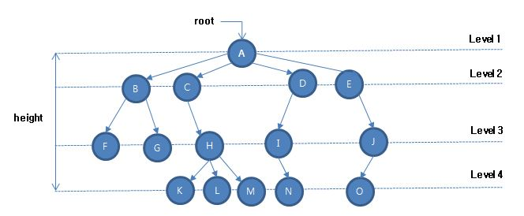

# 21장. 트리의 구현과 순회
## 21.1 도입
### 트리의 구성 요소


트리는 자료가 저장된 노드(node)들이 간선(edge)으로 서로 연결 되어 있는 자료 구조를 말한다.
- 각 노드는 상/하위 관계가 있다.
- 두 연결된 노드 중 상위 노드를 부모(Parent), 자식(Sibling) 라고 한다.
- 부모 노드와 그의 부모들을 통틀어 선조(Ancestor)라고 부르고, 자식노드와 그의 자식들을 통틀어(Descendant)라고 부른다.
- 다른 모든 노드들을 자손으로 갖는 노드 : 루트(root)
- 자식이 하나도 없는 노드: 잎 or 리프(leaf)

#### 트리와 노드의 속성
루트에서 어떤 노드에 도달하기 위해 거쳐야하는 간선의 수를 깊이(depth)라고 한다.
이때, 트리에서 가장 깊숙히 있는 노드의 깊이를 해당 트리의 높이(Height)라고 한다.

#### 트리의 재귀적 속성
모든 트리는 루트와 루트 밑에 있는 서브 트리들의 집합이다.
이와 같은 속성으로 트리를 다루는 코드들은 대게 재귀 호출을 이용해 구현된다.

#### 트리의 표현
일반적인 트리의 형태: 각 노드를 하나의 구조체로 표현하고, 이들을 서로의 포인터로 연결
```c++
struct TreeNode {
    string label; // 저장할 자료(문자열일 필요는 없다.)
    TreeNode* parent; // 부모 노드를 가리키는 포인터
    vector<TreeNode*> children; // 자손 노드들을 가리키는 포인터의 배열
};
```

## 21.2 트리의 순회
선형으로 구성된 배열과 달리 트리는 모든 자료를 순회하기 어렵다.
-> 트리의 재귀적 속성을 이용해야한다.
```c++
void printLabels(TreeNode* root){
    //루트에 저장된 값을 출력
    cout << root->label << endl;
    //각 자손들을 루트로 하는 서브트리에 포함된 값들을 재귀적으로 출력한다.
    for(int i = 0; i< root->children.size(); i++)
        printLabels(root->children[i]);
}
```
*응용: 순회를 이용해 트리의 높이를 계산하기
```c++
int height(TreeNode* root){
    int h = 0;
    for(int i = 0; i < root->children.size(); i++)
        h = max(h, 1 + height(root->children[i]));
    return h;
}
```


## 21.3 문제: 트리 순회 순서 변경
문제 Link:
https://algospot.com/judge/problem/read/TRAVERSAL

## 21.4 풀이: 트리 순회 순서 변경
* Hint 1) 트리 순회 Pseudo Code
> 
        //전위 순회 Pseudo Code
		if(currentNode)
		{
			Visit(currentNode);
			Preorder(currentNode->leftChild);
			Preorder(currentNode->rightChild);
		}
		//중위 순회 Pseudo Code
		if(currentNode)
		{
			Inorder(currentNode->leftChild);
			Visit(currentNode);
			Inorder(currentNode->rightChild);
		}
		//후위 순회
		if(currentNode)
		{
			Postorder(currentNode->leftChild);
			Postorder(currentNode->rightChild);
			Visit(currentNode);
		}

* Hint 2) 전위 순회의 첫번째 Index가 root이다.

* Hint 3) 그림
>
		//Preorder Data
		27 16 9 12 54 36 72
		//Inorder Data
		9 12 16 27 36 54 72

	
```c++
#include <iostream>
#include <string>
#include <algorithm>
#include <vector>
using namespace std;

vector<int> slice(const vector<int> &v, int a, int b)
{
    return vector<int>(v.begin() + a, v.begin() + b);
}

//트리의 전위탐색 결과와 중위탐색 결과가 주어질 때 후위 탐색 결과를 출력한다
void printPostOrder(const vector<int> &preorder, const vector<int> &inorder)
{
    //트리에 포함된 노드의 수
    const int N = preorder.size();

    //기저 사례: 텅 빈 트리면 곧장 종료
    if (preorder.empty())
        return;

    //이 트리의 루트는 전위 탐색 결과로부터 곧장 알 수 있다
    const int root = preorder[0];

    //이 트리의 왼쪽 서브트리의 크기는 중위 탐색 결과에서 루트의 위치를 찾아서 알 수 있다
    const int L = find(inorder.begin(), inorder.end(), root) - inorder.begin();

    //오른쪽 서브트리의 크기는 N에서 왼쪽 서브트리와 루트를 빼면 알 수 있다
    const int R = N - L - 1;

    //왼쪽 서브트리의 순회 결과를 출력
    printPostOrder(slice(preorder, 1, L + 1), slice(inorder, 0, L));

    //오른쪽 서브트리의 순회 결과를 출력
    printPostOrder(slice(preorder, L + 1, N), slice(inorder, L + 1, N));

    //후위 순회이므로 루트를 가장 마지막에 출력
    cout << root << " ";
}

int main(void)
{
    int test_case;
    cin >> test_case;

    for (int i = 0; i < test_case; i++)
    {
        int N;
        cin >> N;
        vector<int> preorder, inorder;
        for (int i = 0; i < N; i++)
        {
            int node;
            cin >> node;
            preorder.push_back(node);
        }

        for (int i = 0; i < N; i++)
        {
            int node;
            cin >> node;
            inorder.push_back(node);
        }
        printPostOrder(preorder, inorder);
        cout << endl;
    }
    return 0;
}
```

## 21.5 문제: 요세
문제 Link:
https://algospot.com/judge/problem/read/FORTRESS

## 21.6 풀이: 요세
```c++
#include <iostream>
#include <vector>
#include <algorithm>
using namespace std;
struct Wall{
    int y;
    int x;
    int r;
};

struct TreeNode{
    vector<TreeNode*> children;
};

Wall wall[101];
int longest;
int N, T;
 
int sq(int x){
    return x * x;
}
bool enclose(int a, int b){
    if(wall[a].r <= wall[b].r) return false;
 
    int y1 = wall[a].y;
    int x1 = wall[a].x;
    int r1 = wall[a].r;
    int y2 = wall[b].y;
    int x2 = wall[b].x;
    int r2 = wall[b].r;
    if(sq(r1 - r2) <= sq(x1 - x2) + sq(y1 - y2)){
        return false;
    }
    return true;
}
 
bool isChild(int parent, int child){
    if(parent == child) return false;
    if(!enclose(parent, child)) return false;
    for(int i = 0 ; i < N; i++){
        if(i == parent || i == child) continue;
        if(enclose(parent, i) && enclose(i, child)) return false;
 
    }
    return true;
}
TreeNode* getTree(int root){
    TreeNode* node = new TreeNode();
    for(int i = 0 ; i < N; i++){
        if(isChild(root, i)){
            node->children.push_back(getTree(i));
        }
    }
    return node;
}
 
int height(TreeNode* root){
    int s = root->children.size();
    vector<int> heights;
    for(int i = 0 ; i < s; i++){
        heights.push_back(height(root->children[i]));
    }
    if(heights.empty()) return 0;
    int h_s = heights.size();
    if(h_s >= 2){
        sort(heights.begin(), heights.end());
        longest = max(longest, heights[h_s - 1] + heights[h_s - 2] + 2);
    }
    return heights.back() + 1;
}

bool cmp(Wall a, Wall b){
    return a.r > b.r ? true : false; 
}

int main(void){
    scanf("%d", &T);
    while(T--){
        longest = 0;
        scanf("%d", &N);
        for(int i = 0 ; i < N; i++){
            int x, y, r;
            scanf("%d %d %d", &x, &y, &r);
            wall[i] = {y, x, r};
        }
 
        sort(wall, wall + N, cmp);
 
        TreeNode* root = getTree(0);
        printf("%d\n", max(longest, height(root)));
    }
}
```
