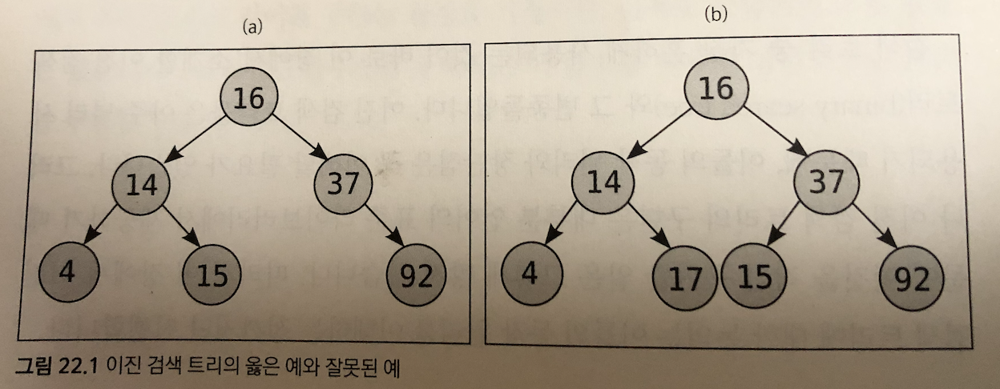
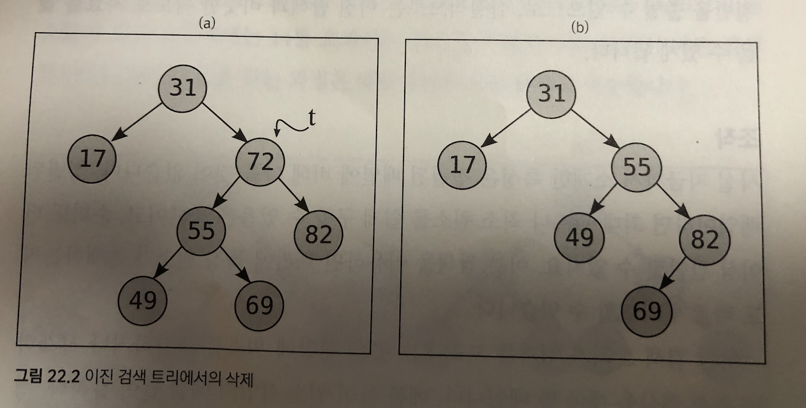
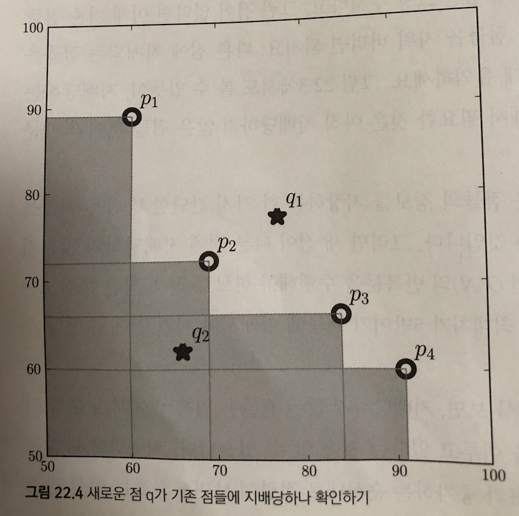

# 22장. 이진 검색 트리
## 22.1 도입
### 이진트리는 검색트리의 한 종류
검색트리 사용 예시
> 
    - 이미 가입한 사용자들의 주민등록번호를 저장해 두고, 특정 사용자가 이미 가입되어있나 찾기
    - 사용자의 ID를 사용자 정보로 대응시키는 사전 객체 만들기
    - 모든 학생들의 시험 점수를 저장해 놓고, 나보다 1등 위인 사람과 1등 아래인 사람 찾기 
    - 등등
* 이진 검색 트리는 대부분의 언어의 라이브러리로 제공.
* 라이브러리가 제공하지 않는 연산이 필요한 경우, 트리를 직접 구현해야함 (22.6절 트립 참조)

## 22.2 이진 검색 트리의 정의와 조작
### 정의
#### 1) 이진 트리의 정의
>
    각 노드가 왼쪽과 왼쪽, 최대 두 개의 자식 노드만을 가질 수 있는 트리

#### 2) 이진 검색 트리의 정의
> 
    이진 탐색(Binary Search)에서 아이디어를 가져와서 만든 트리.
    N개의 원소 증 원하는 값을 찾는데, 매번 후보의 수를 줄일 수 있다면 O(logN) 시간에 값을 찾을 수 있음



### 순회
이진 검색 트리를 중위 순회를 하면 정렬된 결과를 얻을 수 있다.
(현재 노드보다 작은 원소들은 모두 왼쪽 큰 원소는 오른쪽 서브 트리에 있기 때문)
>
    중위 순회 Inorder Traversal
    left -> root -> right
    왼쪽 자식 노드  -> 부모노드 -> 오른쪽 자식 노드
### 자료의 검색
이진 탐색과 비슷한 속도로 자료를 찾을 수 있다.

### 조작
배열 보다 뛰어난 특성
1. 데이터 추가:
새 원소가 들어갈 위치를 찾고 거기에 노드를 추가하면 됨.  
2. 데이터 삭제:
삭제할 노드의 왼쪽/오른쪽 서브 트리를 합친 트리를 원래 서브 트리로 대체.


## 22.3 시간 복잡도 분석과 균형 잡힌 이진 검색 트리
데이터가 한쪽으로 치우쳤다면(skewed) 이진 검색트리를 사용하는 의미가 없다. O(N)
이러한 단점을 개선하기 위해 여러 트리의 변종이 있다. 이를 균형 잡힌 이진 검색 트리라고 부른다.
(트리의 높이가 항상 O(logN)을 유지, 대표적인예 : Red-Black Tree )

## 22.4 문제: 너드인가, 너드가 아닌가? 2
문제 Link:
https://algospot.com/judge/problem/read/NERD2

## 22.4 문제 풀이:

* Input이 5만이기 때문에 O(N^2)으로 풀 수 없음
* Hint 1) 그림 22.3(d)를 보면, 지배 당하지 않는 점들은 왼쪽에서 오른쪽 아래로 가는 계단 모양을 이루고 있음.
  X좌표가 증가하는 순서대로 정렬해 보면 Y좌표는 항상 감소하게 되어있다.
  

* Hint 2) 바로 오른쪽에 있는 점만 확인하면 이 점이 지배 당하는지 아닌지를 알 수 있다.
* Hint 3) C++ Map 
> 
    map과 set클래스는 upper_bound와 lower_bound라는 메서드를 가지고 있다. 두 함수는 반대되는 개념일것 같지만 거의 유사한 기능을 한다.
    upper_bound함수의 경우 컨테이너의 오른쪽 원소 중 기준 원소보다 큰 값중 가장 왼쪽에 있는 원소의 iterator값을 리턴한다.
    lower_bound함수의 경우 오른쪽 원소 중 기준 원소와 같거나 큰 값 중 가장 왼쪽에 있는 원소의 iterator값을 리턴한다.
    차이점은 같은 값을 포함하느냐 마느냐의 차이만 있다.
    https://velog.io/@doontagi/C-map-%ED%81%B4%EB%9E%98%EC%8A%A4%EC%99%80-upperbound-lowerbound-%EB%A9%94%EC%84%9C%EB%93%9C

```c++
#include<iostream>
#include<string>
#include<vector>
#include<cassert>
#include<algorithm>
#include<queue>
#include<map>
using namespace std;
 
//현재 다른 점에 지배당하지 않는 점들의 목록을 저장한다.
//coords[x]=y
map<int, int > coords;
//새로운 점(x,y)가 기존의 다른 점들에 지배당하는지 확인한다.
bool isDominated(int x, int y) {
    //x보다 오른쪽에 있는 점 중 가장 왼쪽에 있는 점을 찾는다.
    map<int, int>::iterator it = coords.lower_bound(x);
    //그런 점이 없으면(x,y)는 지배당하지 않는다.
    if (it == coords.end()) return false;
    //이 점은 x보다 오른쪽에 있는 점 중 가장 위에있는점이므로,
    //(x,y)가 어느점에 지배되려면 이 점에도 지배되어야 한다.
    return y < it->second;
}
void removeDominated(int x, int y) {
    map<int, int >::iterator it = coords.lower_bound(x);
    //(x,y)보다 왼쪽에 있는 점이 없다!
    if (it == coords.begin()) return;
    --it;
    //반복문 불변식:it는 (x,y)의 바로 왼쪽에 있는 점.
    while (true) {
        //(x,y)바로 왼쪽에 오는 점을 찾는다.
        //it가 표시하는 점이 (x,y)에 지배되지 않는다면 곧장 종료
        if (it->second > y) break;
        //이전 점이 더 없으므로 it만 지우고 종료한다.
        if (it == coords.begin()) {
            coords.erase(it);
            break;
        }
        //이전 점으로 이터레이터를 하나 옮겨 놓고 it를 지운다.
        else {
            map<int, int>::iterator jt = it;
            --jt;
            coords.erase(it);
            it = jt;
        }
    }
}
//새 점 (x,y)가 추가되었을 때 coords를 갱신하고,
//다른 점에 지배당하지 않는 점들의 개수를 반환한다.
int registered(int x, int y) {
    //(x,y)가 이미 지배당하는 경우에는 그냥 (x,y)를 버린다.
    if (isDominated(x, y)) return coords.size();
    //기존에 있던 점 중(x,y)에 지배당하는 점들을 지운다.
    removeDominated(x, y);
    coords[x] = y;
    return coords.size();
}
 
 
int main(void) {
    int cases;
    cin >> cases;
 
    while (cases--) {
        int n;
        cin >> n;
        int sum = 0;
        coords.clear();
        for (int i = 0; i < n; i++) {
            int a, b;
            cin >> a >> b;
            sum+=registered(a, b);
        }
        cout << sum << endl;
 
    }
    return 0;
}
```
