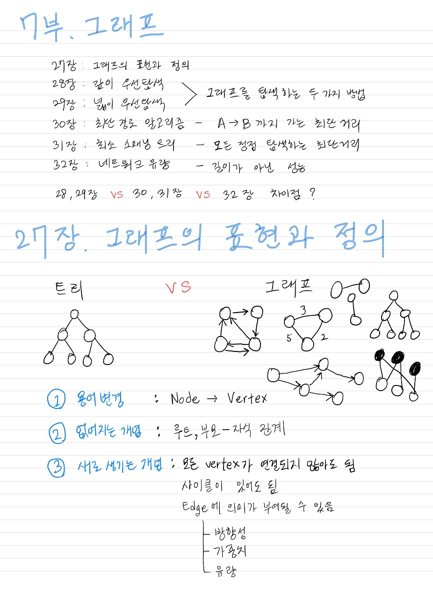
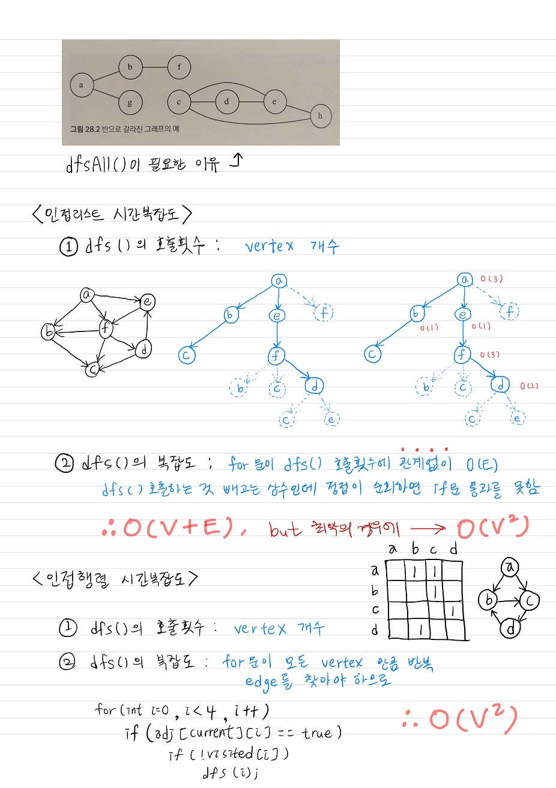
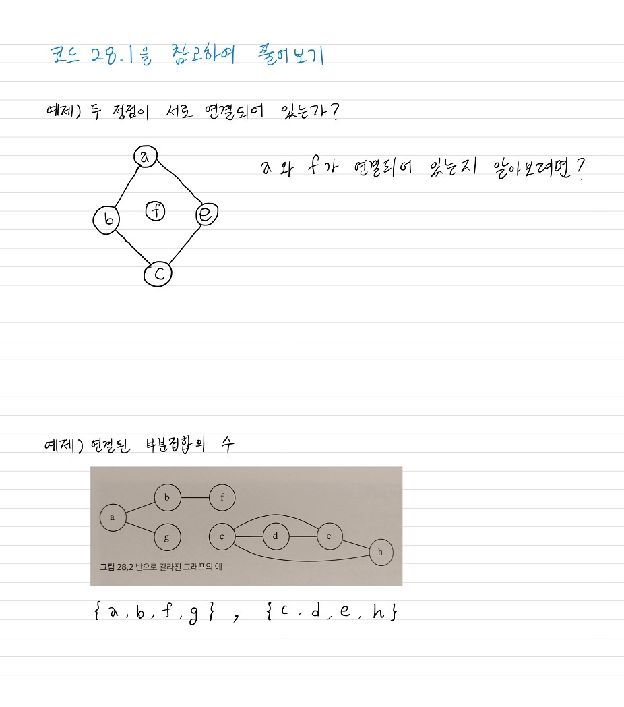
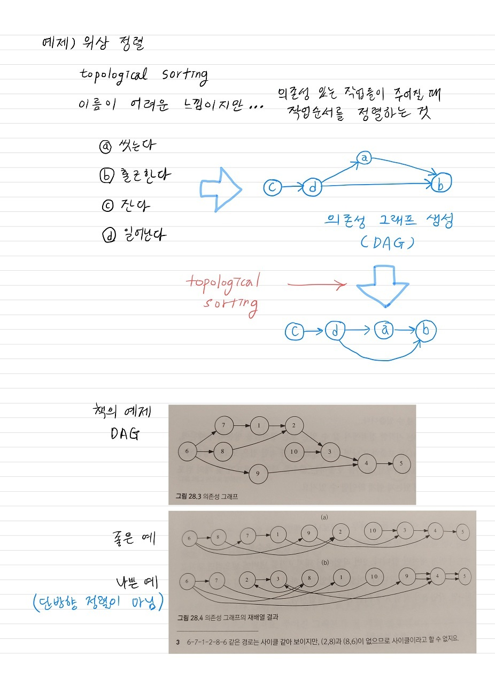
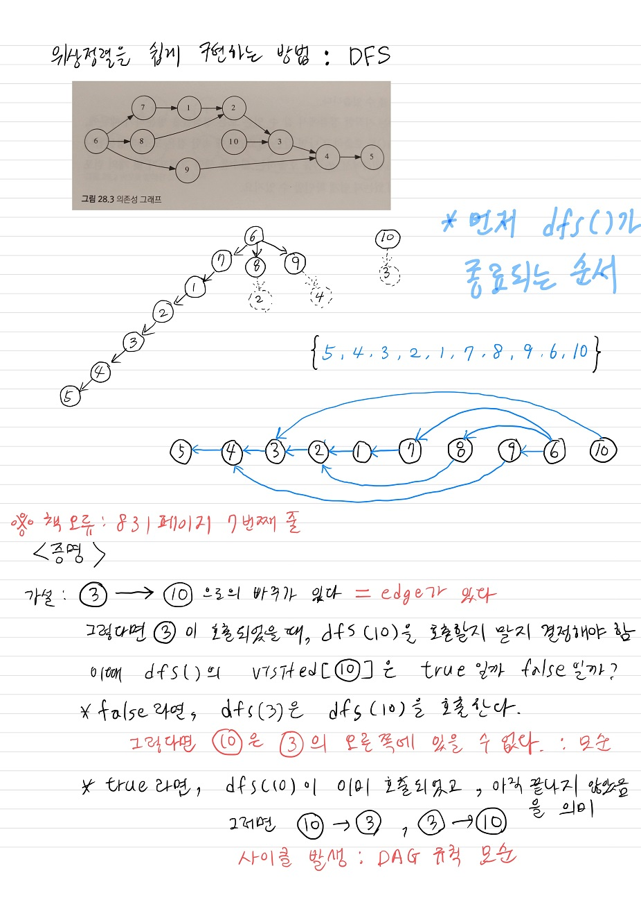
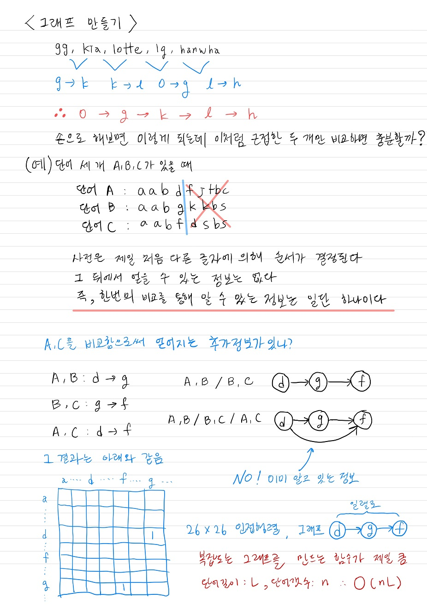
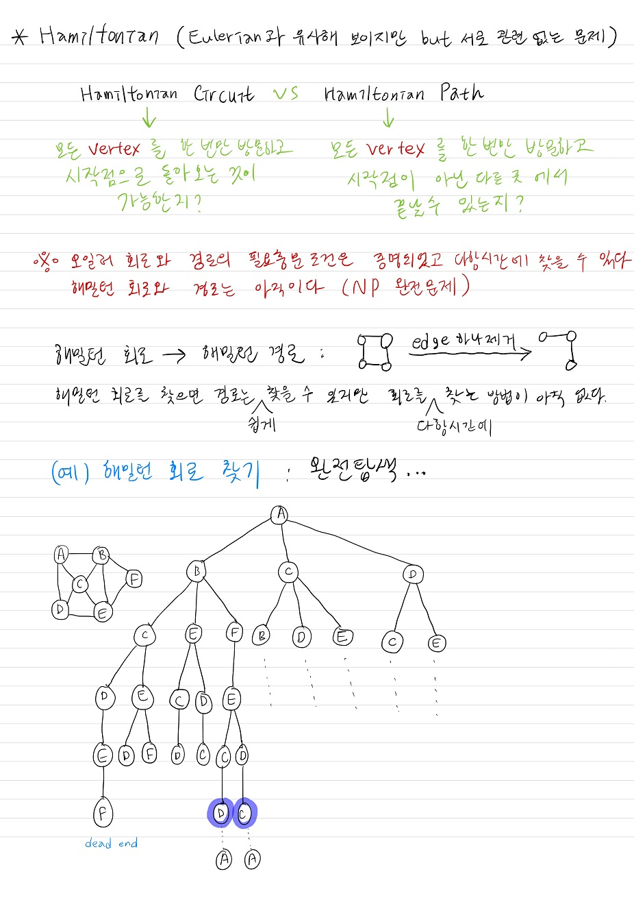
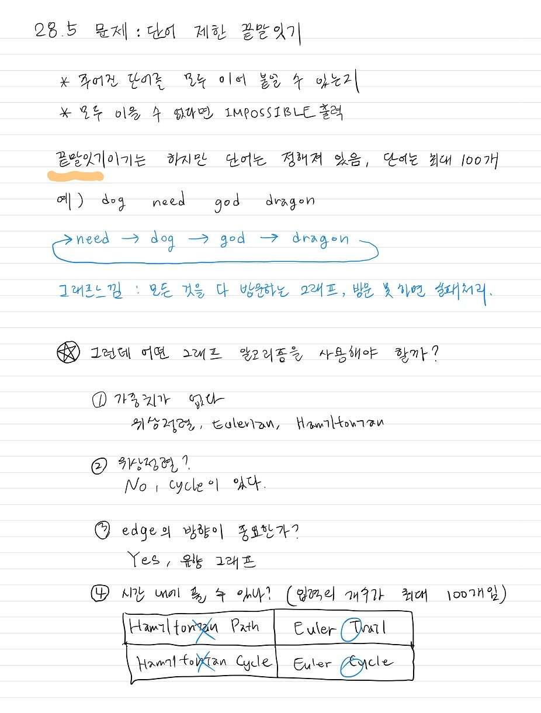
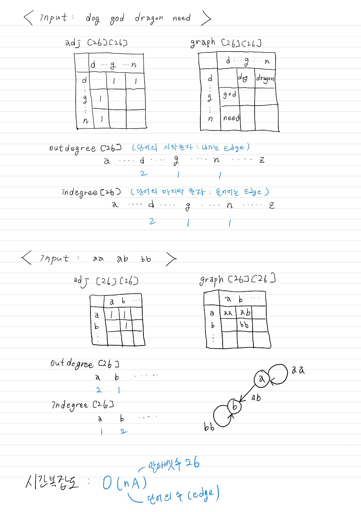
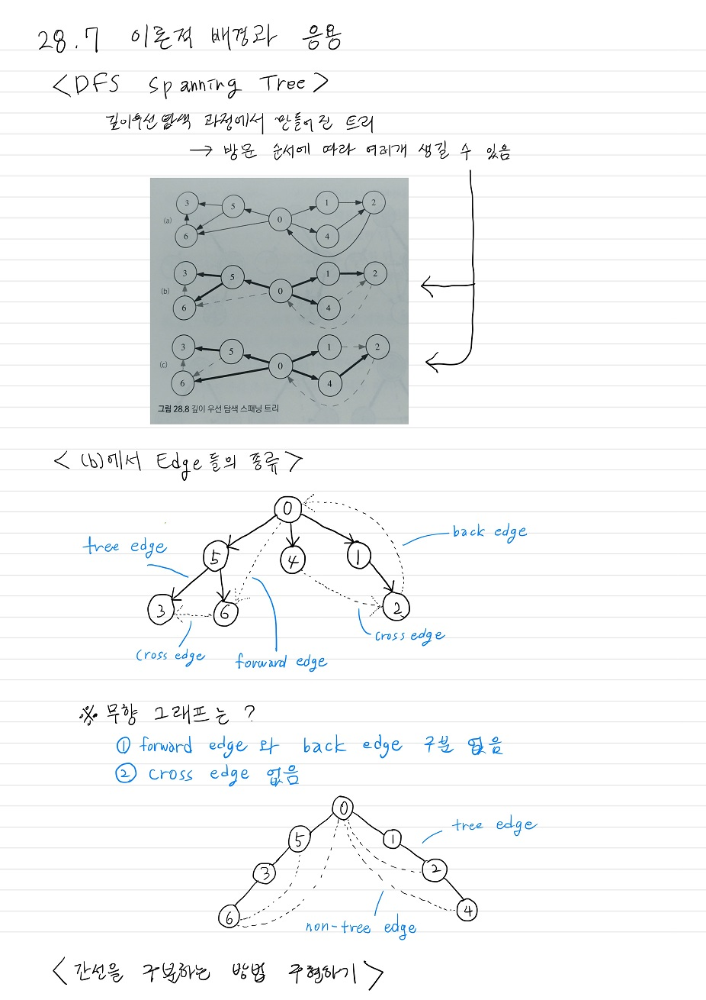

## 코드 28.1 : 깊이 우선탐색 소스코드

```cpp
vector<vector<int>> adj;
vector<bool> visited; 
 
void dfs(int here) 
{ 
    cout <<"DFS visits" << here << endl; 
    visited[here] = true; 
 
    for(int i =0; i < adj[here].size(); ++i) { 
        int there = adj[here][i]; 
 
        if(!visited[there]) 
            dfs(there); 
    }   
} 
 
void dfsAll() 
{ 
    visited = vector<bool>(adj.size(), false); 
 
    for(int i = 0; i < adj.size(); ++i) 
        if(!visited[i])
            dfs(i);
}
```









## 코드 28.2~3 : 고대어 사전 소스코드

```cpp
#include <iostream>
#include <vector>
#include <algorithm>
#include <string>

using namespace std;

vector<vector<int>> adj;

void makeGraph(const vector<string>& words)
{
    adj = vector<vector<int>>(26, vector<int>(26,0));

    for(int j = 1; j < words.size(); ++j)
    {
        int i = j - 1;
        int len = min(words[i].size(), words[j].size());

        for(int k = 0; k < len; ++k)
        {
            if(words[i][k] != words[j][k])
            {
                int a = words[i][k] - 'a';
                int b = words[j][k] - 'a';

                adj[a][b] = 1;

                break;
            }
        }
    }
}

vector<int> seen, order;

void dfs(int here)
{
    seen[here] = 1;

    for(int there = 0; there < adj.size(); ++there)
        if(adj[here][there] && !seen[there])
            dfs(there);

    order.push_back(here);
}

vector<int> topologicalSort()
{
    int n = adj.size();
    seen = vector<int>(n, 0);
    order.clear();

    for(int i = 0; i < n; ++i)
        if(!seen[i])
            dfs(i);

    reverse(order.begin(), order.end());

    for(int i = 0; i < n; ++i)
        for(int j = i+1; j < n; ++j)
            if(adj[order[j]][order[i]])
                return vector<int>();

    return order;
}

int main()
{
    string input;
    getline(cin, input);

    int cnt = stoi(input);

    for (int i = 0; i < cnt; ++i)
    {
        string input;
        getline(cin, input);

        vector<string> words;
        for (int j = 0; j < stoi(input); ++j)
        {
            string input;
            getline(cin, input);

            words.push_back(input);
        }

        for(string item : words)
            cout << item.c_str() << endl;

        makeGraph(words);
        vector<int> result = topologicalSort();

        if(result.size() == 0)
            cout << "INVALID HYPOTHESIS" << endl;
        else
            for(int a : result)
                cout << static_cast<char>(a + 'a') << ' ' << endl;

    }
    return 0;
}
```







## 코드 28.8 : Edge를 분류하는 코드
```cpp
include <iostream>
#include <vector>
#include <algorithm>
#include <string>

using namespace std;

vector<vector<int>> adj;
vector<int> discovered;
vector<int> finished;

int counter = 0;

void dfs2(int here) {
    discovered[here] = counter++;

    for(int i = 0; i < adj[here].size(); ++i) {
        int there = adj[here][i];

        cout << "(" << here << "," << there << ") is a ";

        // 아직 가본적이 없는 경로이므로
        if(discovered[there] == -1) {
            cout << "tree edge" << endl;
            dfs2(there);
        }   

        // 연결된 vertex가 나보다 늦게 discovered 됐으므로 foward edge
        else if(discovered[here] < discovered[there])
            cout << "forward edge" << endl;

        // 자신을 호출했는데 아직 finish가 아니므로 자신의 부모
        else if(finished[there] == 0)
            cout << "back edge" << endl;

        // 자신보다 먼저 발견됐는데 이미 finished 라는 것은 부모,자식 관계가 아니라는 뜻
        else
            cout << "cross edge" << endl;
    }   
    finished[here] = 1;
}

int main() {

    adj = vector<vector<int>>(7);

    adj[0] = vector<int>({ 1, 4, 5, 6 }); 
    adj[1] = vector<int>({ 2 }); 
    adj[2] = vector<int>({ 0 }); 
    adj[4] = vector<int>({ 2 }); 
    adj[5] = vector<int>({ 3, 6 }); 
    adj[6] = vector<int>({ 3 }); 

    discovered = vector<int>(adj.size(), -1);
    finished = vector<int>(adj.size(), 0);

    for(int i = 0; i < adj.size(); ++i)
        if(!finished[i])
            dfs2(i);

    return 0;
}
```

## 코드 28.8 실행결과

```bash
$ ./a.out 
(0,1) is a tree edge
(1,2) is a tree edge
(2,0) is a back edge
(0,4) is a tree edge
(4,2) is a cross edge
(0,5) is a tree edge
(5,3) is a tree edge
(5,6) is a tree edge
(6,3) is a cross edge
(0,6) is a forward edge
```


