## 예제: 절단점 찾기 알고리즘**

###### 절단 점(Cut Vertex)이란?

무향 그래프에서 한 점과 인접한 간선들을 모두 지웠을때 해당 컴포넌트가 두개 이상으로 나뉘어진 정점을 말한다.


위 그래프에서 1,3,5 정점이 각각 절단점이다.

###### 현실 세계에서의 문제:

1) 네트워크를 표현한 그래프에 절단점이 있는 경우:
    해당 라우더가 고장날 경우 이와 연관된 지역은 마비가 될 수 있음
2) 철도망을 표현한 그래프에 절단점이 있는 경우:
    해당 기차역이 폐쇄될 경우 전체 철도망이 마비가 될 수 있음

###### 무향 그래프에서 절단점을 확인하는 방법:

해당 정점을 그래프에서 삭제 한 뒤, 컴포넌트의 개수가 이전보다 늘어났는지 확인.
-> 컴포넌트의 개수를 세는 쉬운 방법 :  DFS

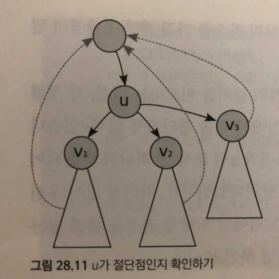

> Hint) 무향 그래프는 교차간선이 존재하지 않는다. (V1 -> V2)
> 교차 간선이란? (page 849)
> -> 트리에서 선조와 자손관계가 아닌 정점들 간에 연결된 간선

u가 지워졌을때, 그래프가 쪼개지지 않는 유일한 방법은 u의 선조(root)와 자손(v1,v2,v3)들이 모두 역방향 간선으로 연결되어있을때임.
따라서 u의 자손들이 역방향 간선을 통해 u의 선조로 올라갈 수 있다면, u는 절단점이 아님.
예외처리) u가 스패닝 트리의 루트 인경우, 자손이 하나도 없거나 하나 밖에 없는 경우엔 절단점이 아님.

## 코드 28.9 : 무향 그래프에서 절단점을 찾는 알고리즘

u정점은 아래 처럼 분류 할 수 있다.

1. ##### u가 root다.

   정점 u가 root인 경우, 자식의 개수에 따라 절단점이 될 수 있고 아닐 수 있다.
   자식이 없는 경우는 당연하고, 하나인 경우에도 root가 사라진다고 두개의 component로 나눠지는 것은 아니기 때문에 자식의 개수가 2개 이상인 경우에만 절단점이 될 수 있다.

2. ##### u가 root가 아니다.

   u가 root가 아닌 경우, DFS Spanning tree 상에서 자식이 현재 정점 u 보다 위로 올라 갈 수 있는지(사이클이 존재하는지)판단하면 된다. 중요한 사실은 자식 중에 u로 올라오는 역방향 간선이 있어도 된다는 점이다. 해당 역방향을 추적기 위해 방문하는 정점에 언제 방문을 했는지를 체크하는 배열을 기존 방문 여부를 확인하는 visited 배열을 변형한다. 보통 구현할 때, 일찍 방문한 정점은 숫자가 낮게 설정한다. 

   코드에서는 이를 discovered로 구현했으며, subTree가 해당 자식 트리가 갈 수 있는 가장 작은 번호(연결 된 정점 중 가장 일찍 발견한 정점)을 반환하게 설정하였다.

   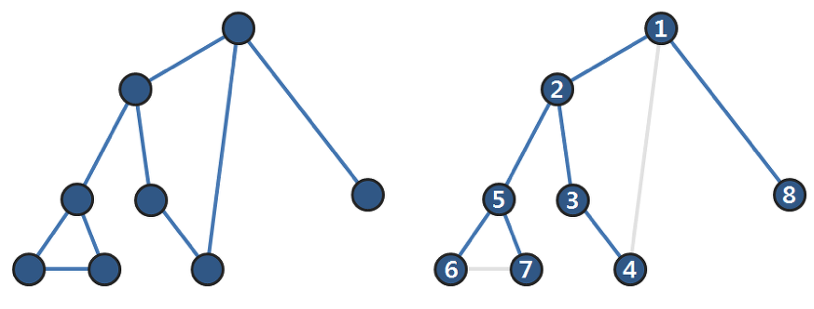
   

```cpp
//그래프의 인접 리스트 표현
vector<vector<int>> adj;
//각 정점의 발견 순서, -1로 초기화 한다.
vector<int> discovered;
//각 정점이 절단점인지 여부를 저장한다. false로 초기화 한다.
vector<bool> isCutVertex;
int counter = 0;

//here를 루트로 하는 서브트리에 있는 절단점들을 찾는다.
//반환 값은 해당 서브트리에서 역방향 간선으로 갈 수 있는 정점 중
//가장 일찍 발견된 정점의 발견 시점. 처음 호출할 때는 isRoot=true로 둔다.
int findCutVertex(int here, bool isRoot) {
	//발견 순서를 기록한다.  
	discovered[here] = counter++;
  int ret = discovered[here];
  int children = 0;
  for(int i = 0; i < adj[here].size(); ++i) {
    int there = adj[here][i];
    if(discovered[there] == -1) {
      //root 인 경우, DFS Spanning tree의 자식 갯수를 알아야한다.
      //자식의 갯수가 1개인 경우는 절단점이 될 수 없다.
      // adj[here].size()을 쓰지 않고 children을 세는 이유 
      //   -> 조상을 포함하고 역방향 간선이 존재할 수 있기 때문에(4->1)
      children++;
      //이 서브트리에서 가장 작은 번호(연결 된 정점 중 가장 일찍 발견한 정점)을 리턴
      int subtree = findCutVertex(there, false);
      //자식이 자신보다 올라갈 수 없다면 절단점!
      if(!isRoot && (subtree >= discovered[here]))
        isCutVertex[here] = true;
      ret = min(ret, subtree);
    }
    else
      ret = min(ret, discovered[there]);
  }
  //루트인 경우 절단점 판정은 서브트리의 개수로 한다.
  if(isRoot)
    isCutVertex[here] = (children >= 2);
  return ret;
}
```


## 예제: 다리 찾기

절단점을 찾는 문제와 유사하게 그래프에서 다리를 찾는 문제가 있습니다.

> 다리의 정의: 
> 어떤 간선을 삭제했을때, 
> 이 간선을 포함하던 컴포넌트가 두개의 컴포넌트로 쪼개질 경우, 이 간선을 다리(Bridge)라고 부릅니다.


위 그림에서 다리는 (0,1) (3,4) (5,6) (5,7) 입니다.

> Tip) 
> 다리는 항상 트리 간선일 수 밖에 없습니다. (간선 설명 p.849)
> 
>
> - 트리간선(tree edge): 스패닝 트리에 포함된 간선을 의미합니다. (그림)에 표시된 모든 굵은 간선
> - 순방향간선(forward edge): 스패닝 트리의 선조에서 자손으로 연결되지만, 트리 간선이 아닌 간선을 말합니다.
>   (그림)의 (0,6) 간선이 순방향 간선의 예입니다.
> - 역방향간선(back edge): 스패닝 트리의 자손에서 선조로 연결되는 간선을 말합니다. (그림)의 (2,0) 간선이 역방향 간선의 예입니다.
>
> 순방향 간선이나 역방향 간선이 생기는 경우 u와 v를 잇는 또 다른 경로가 있다는 말인데, 이는 다리의 정의와 벗어나기 때문입니다. 

## 예제: 강결합 컴포넌트 분리

##### 강결합 컴포넌트(Storngly Connected Components, SCC))란?

무향 그래프와 달리 방향 그래프에서 어떤 그룹 X에 있는 임의의 두 정점 A,B에 대하여 양방향으로 가는 경로가 존재한다면, 이 그룹을 강결합 컴포넌트(Storngly Connected Components, SCC)에 속해있다고 한다.
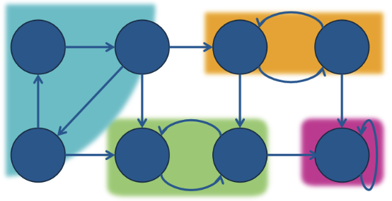

> 강결합 컴포넌트(Storngly Connected Components, SCC)의 특징
>
> 1 . 같은 SCC 내의 임의의 두 정점 A,B사이의 경로가 항상 존재한다.
> 2 . 서로 다른 SCC에서 뽑은 임의의 두 점 A,B 사이의 경로 A->B로 가는 경로와 B->A로 가는 경로는 동시에 존재할 수 없다.

SCC사이를 연결하는 간선들을 모으면, SCC들을 정점으로 하는 방향성 비순환 그래프(Directed Acyclic Graph, DAG)가 된다.

> 방향성 비순환 그래프(DAG)란 개별 요소들이 특정한 방향을 향하고 있으며, 서로 순환하지 않는 구조로 짜여진 그래프를 말한다.


DAG는 시간적으로 이전 트랜잭션에 대해 그 이후 트랜잭션이 검증되는 구조로 [블록체인](http://wiki.hash.kr/index.php/방향성_비순환_그래프)에서 많이 사용된다.
(로커스 체인, IOTA, 헤데라 해시그래프 등)

##### 강결합 컴포넌트 분리를 위한 타잔의 알고리즘

이 DAG를 SCC로 분할하는 간단한 방법은 모든 정점에서 한번씩 깊이 우선탐색을 수행하는 것입니다. 모든 정점 쌍에 양방향 경로가 모두 있는지 쉽게 확인할 수 있지만, O(|V|*|E|)의 시간을 필요로 하기 때문에 그래프가 커질경우 사용할 수 없습니다.

타잔의 알고리즘은 한번의 깊이 우선 탐색으로 각 정점을 SCC별로 분리 가능합니다.
참고: https://blog.naver.com/kks227/220802519976

> 핵심 Idea: 자신의 자손들이 자신의 조상으로 갈 수 있는 경우가 하나도 없는 경우. 자신을 포함한 하나의 SCC가 발견된다.

(그림 1) 
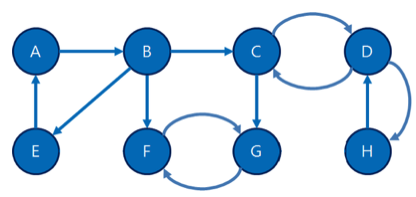

이런 그래프(그림 1)가 있다고 가정해봅시다.

(그림 2)
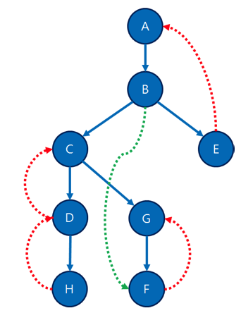

(그림 2)는 (그림 1)에서 A노드부터 DFS방문하여 생성한 DFS트리 입니다.
트리 간선(Blue, Tree Edge), 역방향 간선(Red, Back Edge), 순방향 간선(Green, Forward Edge) 으로 구성됨.

(그림 3)


각 정점 방문 순서대로 dfsn을 1씩 증가시키며 기록, 여기서 중요한 것은 자신노드보다 조상 정점으로 갈 수 있느냐 이기 때문에 순방향 간선(Green, Forward Edge)는 필요 없습니다. 하여 그림에서 삭제하겟음.

(그림 4)

  그림4 : 순방향 간선을 모두 지운 DFS 트리

그림 4 기반으로 SCC 발견 로직을 설명하겠음.
SCC발견 조건: 자신, 자신의 자손들 중 자신의 조상으로 갈 수 있는 경로가 하나도 없을때.

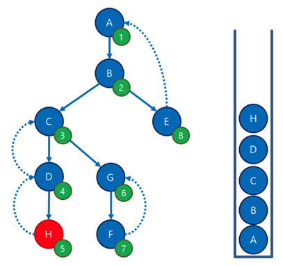

A부터 H까지 DFS 순회하며 방문한 노드를 Stack에 입력, H는 조상(D)으로 갈수 있으니 종료, D또한 조상(C)로 갈수 있으니 종료

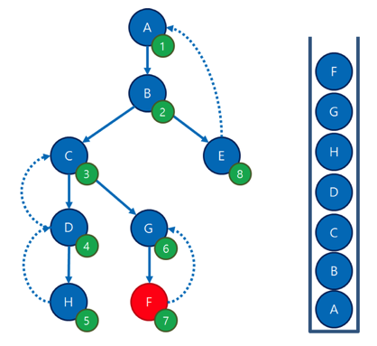

C로 돌아가면 방문할 정점(G)로 갈 수 있으니 계속 진행, F까지 방문한 노드 모두 Stack에 입력.
F는 조상(G)으로 갈 수 있으니 종료

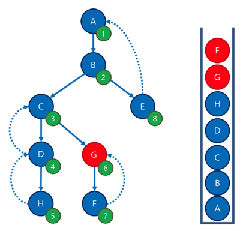

G는 조상으로 갈 수 없으므로 SCC발견 조건에 만족 따라서 Stack에서 G와 G보다 위인 정점(G,F)을 다 뽑아서 SCC로 만듦.

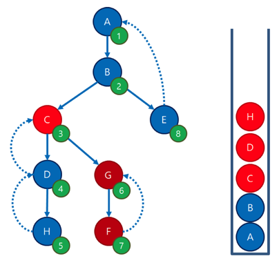

C로 돌아가면, C는 더이상 탐색할 이웃도 없고, C또한 SCC 추출 조건을 만족함. 따라서 Stack에서 C와 C보다 위인 정점(C,D,H)를 다 뽑아서 SCC로 만듦.


B로 돌아가서 다음 탐색할 노드 E로 이동하여 E노드를 Stack에 입력한다. E노드는 자기보다 조상 노드(A)로 갈 수 있으니 이동함.
마지막으로 자기 자신을 포함한 SCC를 추출합니다.

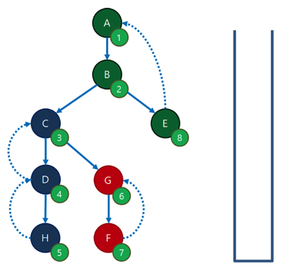

그림 1의 DAG은 {A,B,E}, {C,D,H}, {G,F} 이렇게 총 3개의 SCC로 분리가 됩니다.


## **강결합 컴포넌트 분리 알고리즘의 구현**

```c++
#include <cstdio>
#include <vector>
#include <stack>
#include <algorithm>
using namespace std;
const int MAX = 10000;
 
// SN: SCC 개수, sn[i]: i가 속한 SCC의 번호
int V, E, cnt, dfsn[MAX], SN, sn[MAX];
vector<int> adj[MAX];
bool finished[MAX]; // SCC 분리가 끝난 정점만 true
stack<int> S;
vector<vector<int>> SCC;
 
// 자신의 결과값을 리턴하는 DFS 함수
int DFS(int curr){
    dfsn[curr] = ++cnt; // dfsn 결정
    S.push(curr); // 스택에 자신을 push
 
    // 자신의 dfsn, 자식들의 결과나 dfsn 중 가장 작은 번호를 result에 저장
    int result = dfsn[curr];
    for(int next: adj[curr]){
        // 아직 방문하지 않은 이웃
        if(dfsn[next] == 0)
          result = min(result, DFS(next));
        // 방문은 했으나 아직 SCC로 추출되지는 않은 이웃
        else if(!finished[next])
          result = min(result, dfsn[next]);
    }
 
    // 자신, 자신의 자손들이 도달 가능한 제일 높은 정점이 자신일 경우 SCC 추출
    if(result == dfsn[curr]){
        vector<int> currSCC;
        // 스택에서 자신이 나올 때까지 pop
        while(1){
            int t = S.top();
            S.pop();
            currSCC.push_back(t);
            finished[t] = true;
            sn[t] = SN;
            if(t == curr) break;
        }
        // 출력을 위해 원소 정렬
        sort(currSCC.begin(), currSCC.end());
        // SCC 추출
        SCC.push_back(currSCC);
        SN++;
    }
    return result;
}
 
int main(){
    /* Step1. Input */
    // 그래프 정보 입력
    scanf("%d %d", &V, &E);
    for(int i=0; i<E; i++){
        int A, B;
        scanf("%d %d", &A, &B);
        adj[A-1].push_back(B-1);
    }
 
    /* Step2. Algorithm*/
    // DFS를 하며 SCC 추출
    for(int i=0; i<V; i++)
        if(dfsn[i] == 0) DFS(i);
    // 출력을 위해 SCC들을 정렬
    sort(SCC.begin(), SCC.end());
 
    // Step3. Print
    //SCC 개수
    printf("%d\n", SN);
    // 각 SCC 출력
    for(auto& currSCC: SCC){
        for(int curr: currSCC)
            printf("%d ", curr+1);
        puts("-1");
    }
}
```

## 28.8 문제: 감시 카메라 설치(문제 ID: GALLERY, 난이도: 중)

| 문제                                                         |
| ------------------------------------------------------------ |
| 전세계의 유명한 인물화들을 모아 두는 미술관에 괴도 콩의 도전장이 날아들었습니다. 2022년 2월 2일을 기념하여, 미술관에 전시된 인물화 중 하나의 얼굴을 모 프로게이머의 얼굴로 합성하겠다는 것입니다. 미술관의 관장을 맡고 있는 재하는 이와 같은 사태를 방지하기 위해 감시 카메라를 설치하기로 마음먹었습니다. 미술관은 여러 개의 갤러리와 이들을 연결하는 복도로 구성되어 있으며, 한 갤러리에 감시 카메라를 설치하면 이 갤러리와, 복도로 직접 연결된 갤러리들을 감시할 수 있습니다. 모든 갤러리를 감시하기 위해 필요한 최소 감시 카메라의 수는 몇 개일까요?<br /><br /><u>**미술관은 한 번 관람한 갤러리를 다시 가기 위해서는 이전에 지나왔던 복도를 반드시 한 번 지나야 하는 구조로 설계되어 있으며, 모든 갤러리가 서로 연결되어 있지 않을 수도 있습니다.**</u> |


| 입력                                                         |
| ------------------------------------------------------------ |
| 입력의 첫 줄에는 테스트 케이스의 수 C (C <= 50) 가 주어집니다. 각 테스트 케이스의 첫 줄에는 미술관에 포함된 갤러리의 수 G (1 <= G <= 1000) 와 갤러리들을 연결하는 복도의 수 H (0 <= H < G) 가 주어집니다. 각 갤러리에는 0번부터 G-1 번까지의 고유 번호가 있습니다. 그 후 H 줄에 각 2개의 정수로 각 복도가 연결하는 두 갤러리의 번호가 주어집니다. |

| 출력                                                         |
| ------------------------------------------------------------ |
| 각 테스트 케이스마다 한 줄에 필요한 카메라의 최소 개수를 출력합니다. |

| **예제 입력**                                                |
| ------------------------------------------------------------ |
| 3.            (TC 수)<br />6 5          (TC1 갤러리 6개, 복도 5개)<br />0 1              (TC1 복도 1)<br />1 2              (TC1 복도 2)<br />1 3.             (TC1 복도 3)<br />2 5              (TC1 복도 4) <br />0 4              (TC1 복도 5)<br />4 2          (TC2 갤러리 4개, 복도 2개) <br />0 1              (TC2 복도 1)<br />2 3              (TC2 복도 2)<br />1000 1    (TC3 갤러리 1000개, 복도 1개)<br />0 1              (TC3 복도 1) |


| 예제 출력         |
| ----------------- |
| 3<br />2<br />999 |

## 28.8 문제 풀이: 감시 카메라 설치

각 정점이 자기 자신과 모든 안접한 정점을 지배한다고 할때, 그래프의 모든 정점을 지배하는 정점의 부분집합을 그래프의 지배집합(dominationg set)이라고 부릅니다. 그러나 주어진 그래프에 특정 크기를 갖는 최소 지배집합이 있는지 확인하는 문제는 유명한 NP-Complete 문제중의 하나로, 정점 개수의 지수 함수에 비례하는 시간이 걸립니다.

**루트 없는 트리**

이 문제를 풀 수 있는 중요한 힌트는 문제 설명의 마지막에 붙어 있는 미술관의 구조에 관한 부분에서 주어진다. 이 설명에 따르면 <u>미술관에서 한번 지나간 갤러리를 다시 지나기기 위해서는 전에 지난 복도를 반드시 지나야한다.</u>
 이 속성의 중요한 의미는 미술관을 표현하는 그래프에는 사이클이 존재하지 않는다는 것이다. 그래프에 사이클이 있을 경우, 어떤 복도도 두번 지나지 않고 두 갤러리를 왕복할 수 있기 때문이다.
 이렇게 사이클이 존재하지 않는 그래프는 노드 간의 상하 관계가 없을 뿐이지 트리와 같은 형태를 가지고 있는데, 이와 같은 그래프들을 루트 없는 트리라고 부른다.

| 루트 없는 트리 Hint                                          |
| ------------------------------------------------------------ |
| 1. 정확히 V-1개의 간선이 있습니다<br />2. 사이클이 존재하지 않습니다.<br />3. 두 정점 사이를 연결하는 단순 경로가 정확히 하나 있습니다. |

이 문제에서 모든 갤러리가 서로 연결되어 있을 필요가 없다고 명시되어 있기 때문에, 그래프의 각 컴포넌트가 트리 형태임을 알 수 있다. 각 컴포넌트를 독립적으로 풀어도 된다는 것은 자명하므로, 이제 트리의 최소 지배 집합을 찾는 문제를 풀면된다.

트리의 최소 지배 집합을 찾는 가장 간단한 방법은 트리의 맨 아래에서부터 시작해서 위로 올라오는 것이다. 트리의 루트를 선택해야 할지 말아야 할지는 미리 알기 쉽지 않은 반면, 부모 노드는 그 외의 노드들로 지배할 수 있다. 따라서 잎 노드 대신 그 부모노드를 선택해서 손해 볼 일은 절대 없고, 잎 노드는 절대로 선택할 필요가 없다. 대신 그 부모 노드 모조리 선택해야 한다. 이런 식으로 트리의 맨 밑에서부터 올라가면서 각 노드의 선택 여부를 결정하는 알고리즘을 다음과 같이 설계할 수 있다.

> 1. 잎 노드는 선택하지 않는다.
> 2. 이외의 노드에 대해, 트리의 맨 밑에서 올라오면서 다음과 같이 선택 여부를 결정한다.
>    a. 자기 자손 중 아직 지배당하지 않은 노드가 하나라도 있다면, 현재 노드를 선택한다.
>    b. 이 외의 경우 현재 노드를 선택하지 않는다.


DFS 스패닝 트리 
(Test Case 1)
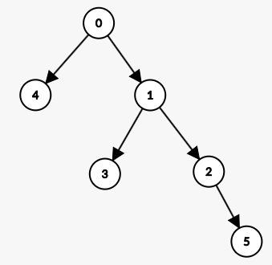

(Test Case 2)


(Test Case3)
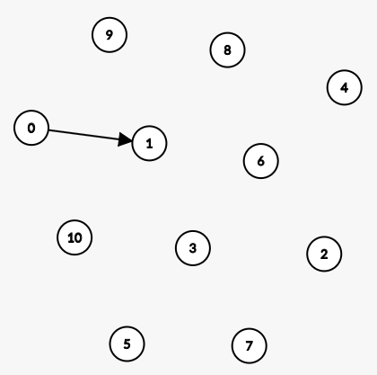

#### 구현 코드)

```c++
#include <cstdio>
#include <algorithm>
#include <cstring>
#include <vector>
using namespace std;
vector<int> adj[1001];
bool visited[1001];
const int WATCHED = 0;
const int UNWATCHED = 1;
const int INSTALLED = 2;

//지금까지 설치한 카메라의 총 수
int installed;
//current node로부터 깊이 우선 탐색을 하고, current node의 정보를 반환한다.(DFS 스패닝트리)
int dfs(int current) {
  visited[current] = true;
  //current node의 자손 중 0: 지배 당하는 중, 1: 지배 안당하는 중, 2: 카메라 설치됨의 갯수를 가지고 있음.
  bool children[3] = {0, };

  for (int i = 0; i<adj[current].size(); i++) {
    int next = adj[current][i];
    if (visited[next] == false) {
      ++children[dfs(next)];
    }
  }
  //자손 노드 중 감시되지 않은 노드가 있을 경우, 카메라를 설치한다.
  if (children[UNWATCHED])
  {
    installed++;
    return INSTALLED;
  }
  //자손 노드 중 카메라가 설치된 노드가 있을 경우, 설치할 필요가 없다.
  if (children[INSTALLED])
    return WATCHED;

  return UNWATCHED;
}
int installedCamera()
{
  installed = 0;
  for (int i = 0; i < g; i++)
    if (!visited[i] && dfs(i) == UNWATCHED) // Test Case 2,3 만족을 위해
      installed++;
  return installed;
}
int main()
{
  int t;
  scanf("%d", &t);
  while (t--)
  {
    int g, h;
    scanf("%d %d", &g, &h);

	  memset(adj, 0, sizeof(a));
	  memset(visited, false, sizeof(visited));

	  for (int i = 0; i < h; i++)
	  {
	    int u, v;
	    scanf("%d %d", &u, &v);
	    adj[u].push_back(v);
	    adj[v].push_back(u);
	  }
    //결과 출력
    printf("%d\n", installedCamera);
  }
}
```